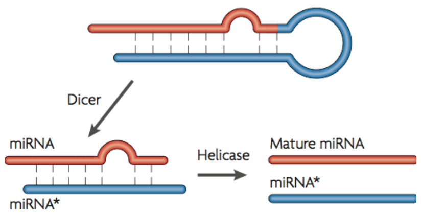

```{r setup, include=FALSE}
knitr::opts_chunk$set(eval=FALSE)
```

## 资源共享


## 任务需求
- 已知：成熟miRNA及其pri-miRNA的相关信息


- 要求：按照位置的重要性将pri-miRNA分段
- 实现：编写程序 …… …… 如何编写程序？

## 了解背景知识：miRNA


## 了解背景知识：miRNA的产生过程——pri2pre


## 了解背景知识：miRNA的产生过程——pre2mature


## 了解背景知识：miRNA的作用方式——种子区域


## 理解输入数据：文件格式及数据信息


## 整合输入数据与任务需求——辅助示意图


## 整合输入数据与任务需求——实例解析


## 整合输入数据与任务需求——从实例到规律


## 整合输入数据与任务需求——实例解析（续）


## 整合输入数据与任务需求——从实例到规律（续）


## 分析规律并进行整合——从规律到逻辑


## 根据逻辑设计程序——从逻辑到设计
1. 获取正负链信息
     - 提取特定列
2. 获取或确定5p/3p信息
     - 模式匹配5p/3p
     - +/-, 成熟miRNA的中点 vs. pri-miRNA的中点
3. 计算A/B/C区域的位置
     - +/-, 5p/3p, A/B/C

## 根据程序设计编写伪代码——从设计到伪代码
```
foreach line
    strand = get_strand
    ps = define_ps
    if strand is "+"
        cal_plus
    if strand is "-"
        cal_minus

sub cal_plus
    cal_plus_AorC
    cal_plus_B

sub cal_minus
    cal_minus_AorC
    cal_minus_B
```

## 根据伪代码设计子程序——从伪代码到子程序
```
get_strand
    in: line or certain column
    out: "+" or "-"

define_ps
    in: line or certain columns
    out: "5p" or "3p"

cal_plus/minus
    in: ps and S and E
    call cal_plus/minus_B
    out: coordinate of A,B,C

cal_plus/minus_B
    in: ps and S and E
    out: coordinate of B
```

## 编写最终的程序——从思考到编程
- 编写程序并进行调试
    1. 规划好最终的输出形式
    2. 用自己熟悉的编程语言编写程序
    3. 对照实例结果校验程序输出
- 如果还是无法编写出程序
    - 没有真正理解程序设计
        - 没有讲解清楚
        - 没有真正听懂
    - 对使用的编程语言不熟悉
- 每次编程都要进行这么繁琐的设计吗？
    - 答案是肯定的！——自己理不清，电脑更糊涂
    - 答案是否定的！——大事可化小，小事可化了

